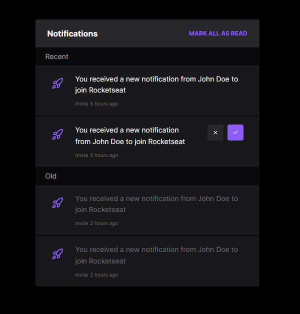
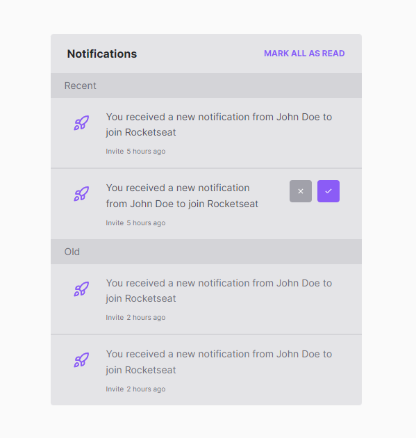

## About

This is a simple widget notification created with Next and Tailwind that handles system theme.

## Dark Mode



## Light Mode



## Run locally

First, run the development server:

```bash
npm run dev
# or
yarn dev
# or
pnpm dev
```

Open [http://localhost:3000](http://localhost:3000) with your browser to see the result.